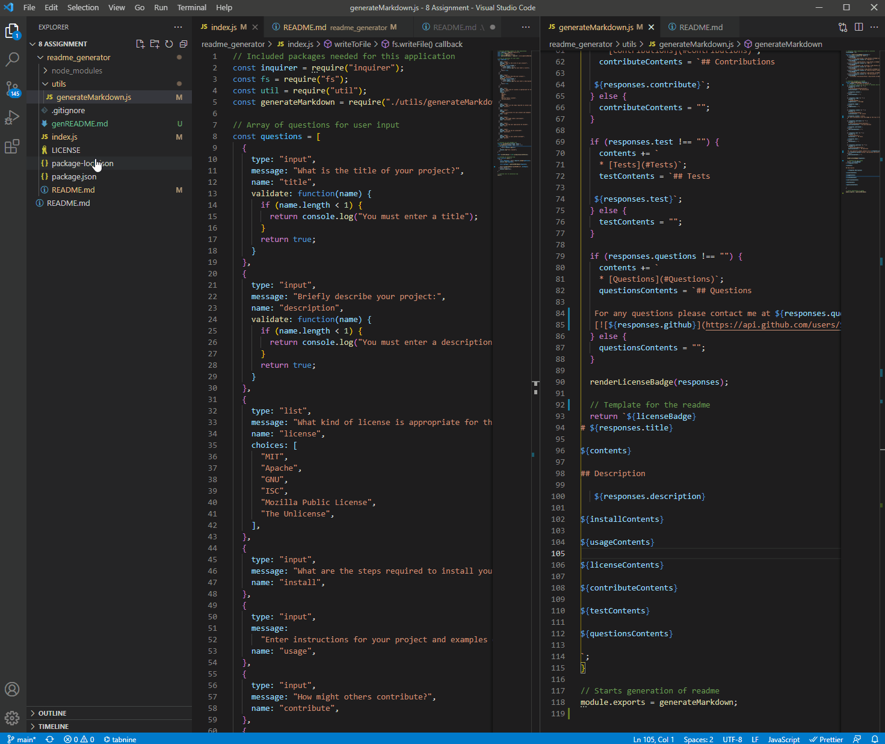

# README Generator

## Table of Contents
   * [Installation](#Installation)
   * [Usage](#Usage)
   * [License](#License)
   * [Contributions](#Contributions)
   * [Questions](#Questions)

## Description

   An application that prompts for user input and dynamically generates a README based on the values added.
   The values available include the following:
    1. Title
    2. Description
    3. Installation
    4. Usage
    5. License
    6. Contributions
    7. Tests
    8. Questions
      a. Contact Email
      b. Link to Github repository

   After the values have been added for each section a table of contents will be generated which, 
   when clicked will take the user to that part of the readme. Finally the appropriate license badge
   will be created at the top of the page.

## Installation

   From the integrated terminal the user will type:
    nmp i
   Followed by pressing enter.
  
## Usage

   

## License

   MIT  

## Contributions

   No contributions at this time.

## Questions

   [[Contact me](mailto:elusiveskies@gmail.com)]
   [[Elusiveskies](https://www.github.com/Elusiveskies)]
